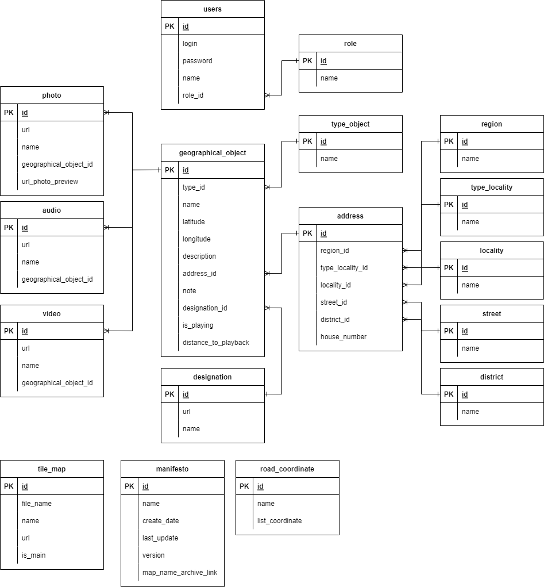

= Руководство администратора

== База данных:
В приложение используется база данных - https://www.postgresql.org/[PostgreSQL], ER-модель которой выглядит следующим образом:

=== Создание БД:
Генерацией таблиц БД занимается *Hibernate*.
Для этого необходимо создать базу данных PostgreSQL и указать данные к ней в application-dev\server.properties,
в зависимости от "вида" запуска (dev\server).

URL до бд:
[source, properties]
spring.datasource.url=jdbc:postgresql://localhost:5432/name_data_base

Указать username и password к БД:
[source, properties]
spring.datasource.username=username

[source, properties]
spring.datasource.password=password

Важным моментом является указания типа DDL, которым Hibernate оперирует для создания таблиц:
[source, properties]
spring.jpa.hibernate.ddl-auto=create-drop

* create – Hibernate сначала удаляет существующие таблицы, а затем создает новые таблицы.
* create-drop – аналогично create, но Hibernate удалит базу данных после завершения всех операций. Обычно используется для модульного тестирования.
* update - объектная модель, созданная на основе сопоставлений (аннотаций или XML), сравнивается с существующей схемой,
а затем Hibernate обновляет ее в соответствии с различием. Он никогда не удаляет существующие таблицы или столбцы, даже если они больше не требуются приложению.
* validate - Hibernate только проверяет, существуют ли таблицы и столбцы; в противном случае он выдает исключение.
* none – ничего не делает со схемой, не вносит никаких изменений в базу данных.

В приложении *_рекомендуется_* использовать *update*. С этим параметром *необходимо быть осторожным*, чтобы *не* потерять данные в бд.
В случае дальнейшего развития приложения рекомендуется запретить hibernate авто-генерацию и перевести приложение на *https://www.liquibase.org[liquibase]*.

== Настройка конфигураций сервера Nginx:
Приложение располагается на HTTP-сервере https://nginx.org/ru/[Nginx]

Для корректной работы приложения необходимо настроить сервер. https://nginx.org/ru/docs/beginners_guide.html[Руководство для начинающих - Nginx]
Разумеется его сначала нужно *установить*. После установки nginx открываем nginx.conf, который находится в */etc/nginx/* _(путь из linux ubuntu)_

В блочной директиве http и устанавливаем параметр

**_Задаём максимально допустимый размер тела запроса клиента._**
[source, text]
client_max_body_size 6000M;

Параметр равный 6 ГБ требуется для тайлов карт, хранимых на сервере.

После настройки файлов конфигурации необходимо перезагрузить сервер командой:
[source, text]
nginx -s reload

Далее открываем файл *default* в */etc/nginx/sites-enabled/*
В блочной директиве server указываем параметры:

[source, text]
listen 80 default_server;
listen [::]:80 default_server;

[source, text]
location /api {
    proxy_set_header Host $host;
    proxy_set_header X-Real-IP $remote_addr;
    proxy_pass http://localhost:8080;
    proxy_connect_timeout 5;
    proxy_send_timeout 10;
    proxy_read_timeout 10;
}

[source, text]
location /api/v1/tile-map {
    proxy_set_header Host $host;
    proxy_set_header X-Real-IP $remote_addr;
    proxy_pass http://localhost:8080;
    proxy_read_timeout 5h;
}
[source, text]
location /actuator {
    proxy_set_header Host $host;
    proxy_set_header X-Real-IP $remote_addr;
}

Перезагружаем сервер.
[source, text]
nginx -s reload

== Настройка application.properties:
В application.properties находится профиль запуска приложения, установленное значение: *default*
Таким образом при передаче в параметры запуска приложения dev\server приложение запускается с определенным application-dev\server.properties
*dev* - _профиль для разработки._
*server* - _профиль для deploy на сервер._

Рассмотрим  application-dev.properties:

Настройки, которые мы можем\должны отредактировать это:

[source, text]
logging.file.name=fileStorage/logs/log.txt

Указываем путь, по которому будут сохраняться логи приложения.

[source, text]
logging.logback.rollingpolicy.max-file-size=10MB

Указываем максимальный размер файла с логами.

[source, text]
logging.logback.rollingpolicy.max-history=7

Указываем максимальное количество дней для хранения логов.

[source, text]
file.storage.audio.location=fileStorage/audio
file.storage.photo.location=fileStorage/photo
file.storage.photoPreview.location=fileStorage/photoPreview
file.storage.video.location=fileStorage/video
file.storage.tile-map.location=fileStorage/tile-map
file.storage.designation.location=fileStorage/designation

Обязательно указываем актуальный путь до хранилища медиа-файлов и тайлов-карт.

[source, text]
file.extension.audio = mp3, ogg, wav, aiff, flac, mpeg, m4a, x-m4a
file.extension.photo = jpeg //С учетом сжатия допускается только jpeg формат.
file.extension.video = avi, mp4, mkv, wmv, asf, mpeg
file.extension.tile-map = rar, vnd.rar, rar4, zip
file.extension.designation = jpeg, png

Можем отредактировать расширения, которые пропускаются, при загрузке медиа-файлов.

[source, text]
spring.servlet.multipart.max-file-size=6000MB
spring.servlet.multipart.max-request-size=6000MB

Указываем максимальный размер пропускаемого файла и запроса.
Параметр в 6ГБ требуется для тайлов карт.

[source, text]
jwt.token.secret=secret
jwt.token.expired=86400000

Обязательно указываем секретное слово, с помощью которого создается JWT-токен.

[source, text]
server.url=http://localhost:8080

Обязательно указываем адрес сервера. От этого параметра формируется ссылки на скачивания медиа-файлов.

== Подготовка приложения:
Теперь необходимо подготовить приложение для его корректной работы.
Подключаемся к базе данных. Это можно сделать командой:
[source, text]
----
sudo -u postgres psql -d name_db
----

При условии, что БД *пустая*, мы вводим начальные данные:
[source, postgresql]
----
insert into role VALUES
('00000000-0000-0000-0000-000000000000', 'ROLE_ADMIN'),
('00000000-0000-0000-0000-000000000001', 'ROLE_TILE_EDITOR');

insert into users VALUES
('00000000-0000-0000-0000-000000000000',
'login',
'name',
'bcrypt(password)',
'00000000-0000-0000-0000-000000000000'),

('00000000-0000-0000-0000-000000000001',
'tile_editor',
'tile_editor',
'bcrypt(password)',
'00000000-0000-0000-0000-000000000001');
----

Далее заполняем таблицу типа местностей:

[source, postgresql]
----
insert into type_locality VALUES
('c763011f-1cc6-4d6b-96ba-78d7db4f60f6', 'Город'),
('fa8a0020-1a49-4994-bda4-ac38a16eebf3', 'Деревня'),
('28ca0a50-d2ee-4a21-9146-21ba60b6b800', 'Поселок'),
('dab829da-2f14-41fb-b96c-776901959454', 'Село'),
('be36eab4-338d-4594-9be5-97ebf450baf5', 'Станица'),
('7dfb7642-ab8a-4f8d-be78-36d1d72e4d97', 'Аул'),
('705e67c5-1edf-4b40-9bd0-d5275edfde62', 'Хутор');
----

Далее заходим на UI и создаем designation: "Отсутствует"

На этом иниализация начальными данными подходит к концу.

== Deploy приложения на сервер:
Деплой на сервер осуществляется с помощью скрипта, который находится в `./script/`

Настраиваем скрипт-деплоя и вызываем его через terminal.

[source, text]
/scripts/deploy.sh

Скрипт собирает приложение и копирует его на сервер. После копирования происходит запуск приложения.

Логи приложения выводятся в файл log.txt. Открыть файл можно командой `tail -f log.txt` на linux.
Так же есть логи за последние 7 дней в каталоге /fileStorage/logs/

== Создание скрипта и настройка планировщика задач
Теперь необходимо создать скрипт, который раз в сутки будет очищать файл с логами на сервере.
Для этого воспользуемся сервисом "_Cron_" в Linux.

Для начала напишем скрипт:
[source, bash]
----
echo "Файл с логами был очищен:" $(date) > /pathToLog/log.txt
----
Сохраняем с расширением `.sh`

Перейдем к запуску скрипта через "_Cron_"
Откроем конфигурационный файл, в котором хранится информацию о запускаемых скриптах.
[source, bash]
----
crontab -e
----
Добавляем туда наш cron и путь до скрипта:
----
0 23 * * * bash /patToScript/task-of-clearing-app-log.sh
----

Теперь поясню что значит `0 23 * * *`:

Таблица crontab состоит из 6 колонок, которые разделяются пробелами.
Первые пять колонок отвечают за время выполнения: `минута`, `час`, `день месяца`, `месяц`, `день недели`

[source, text]
----
Example of job definition:
# .---------------- minute (0 - 59)
# |  .------------- hour (0 - 23)
# |  |  .---------- day of month (1 - 31)
# |  |  |  .------- month (1 - 12) OR jan,feb,mar,apr ...
# |  |  |  |  .---- day of week (0 - 6) (Sunday=0 or 7) OR sun,mon,tue,wed,thu,fri,sat
# |  |  |  |  |
# *  *  *  *  * user-name command to be executed
----

Теперь мы можем посмотреть содержимое файла:
[source, bash]
----
crontab -l
----

Далее создадим еще один скрипт для проверки работоспособности приложения.
[source, text]
----
url="http://localhost:8080/actuator/health"
status_code=$(curl -s -o /dev/null -I -w %{http_code} ${url})
path_to_save_logs_app="/pathToSave/log.txt"
path_to_save_report_healthcheck="/pathToSave/healthcheck.txt"
if [[ "$status_code" != 200 ]] ; then
  echo $(date) Current status: $status_code. The application is not working correctly. A restart is in progress. >> $path_to_save_report_healthcheck
  pgrep java | xargs kill -9
  nohup java -jar Mobile-map-0.0.1-SNAPSHOT.war >> $path_to_save_logs_app &
else
  echo $(date) The app is working! >> $path_to_save_report_healthcheck
fi
----

Аналогичным образом создадим крону для вызова этого скрипта.
Вызов будет производиться каждые 5 минут.

[source, text]
----
*/5 * * * * bash /home/ladmin/MobileMap/script/healthcheck.sh
----

Так же добавим в первый скрипт очищение healthcheck.txt раз в сутки.
Теперь скрипт с очищением выглядит следующим образом.
[source, text]
----
echo "Файл с логами был очищен:" $(date) > /pathToLog/log.txt
echo "Файл с отчетом по healthcheck был очищен:" $(date) > /pathToLog/healthcheck.txt
----

== Прочее:
==== Как сделать резервное КОПИРОВАНИЕ?
Чтобы скопировать ТОЛЬКО данные
[source, postgresql]
----
pg_dump --data-only -U postgres -W db_name > /path-to-save/test-dump.dump
----
Если хотите сделать полный дамп БД:
[source, postgresql]
----
pg_dump -U postgres -W db_name > /path-to-save/test-dump.dump
----
test-temp.dump - примерное наименование файла. Все индивидуально.

==== Как сделать резервное ВОССТАНОВЛЕНИЕ?
[source, text]
----
psql -U postgres -W geo_data < /path-to-save/test-dump.dump
----
Далее выведется сообщение о вставке данных в бд.

==== Что делать, если приложение отключилось?

Если случилось такое, что приложение отключилось, вам нужно перезапустить его в ФОНОВОМ режиме.
Делается так:
[source, text]
----
nohup java -jar Mobile-map-0.0.1-SNAPSHOT.war >> log.txt &
----